# Penetration testing
https://ctf.school/challenges

- [ Databases ](#db)
- [ File reading ](#files)
- [ Cookies ](#cookies)

<a name="db"></a>
## Databases
#### Сайт активно использует базы данных. Попробуй провести SQL-инъекции.

Сайт, видимо, интернет-магазин одежды. <br>
На входе мы видим форму логина.

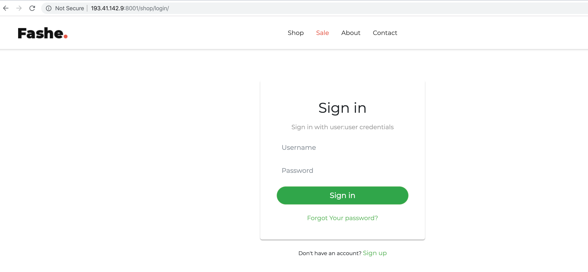

В задании сказано про SQL-инъекции. Вооружимся шпаргалками:
- https://ru.bmstu.wiki/SQL-инъекция
- https://defcon.ru/web-security/2784/

Час промучавшись с формой, вбивая данные вида `admin'--` / `pass` и пытаясь обойти проверку пароля, <br>
замечаем надпись "Sign in with user:user credentials" :trollface: 

Пройдя аутентификацию, попадаем внутрь магазина.


Шерстим странички в поисках форм, где можно бы было заиспользовать инъекции. <br>
Находим поисковую форму на странице продуктов.


Пытаемся получить какие-то дополнительные "скрытые" продукты с помощью инъекций:
- `1\' UNION SELECT * from products; --`
- `1\' or 1 = 1; --` (атака на WHERE)
- `%%' --` (атака на LIKE)

Но безуспешно :(

Смотрим код страницы и видим URL изображения продукта:
```html

```

Так-с, значит есть статика. Попробуем зайти в неё напрямую.

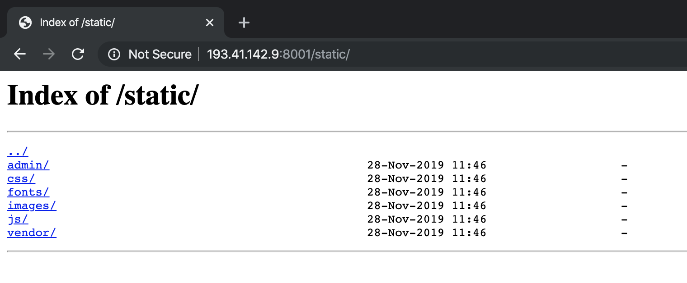

Что у нас в изображениях?

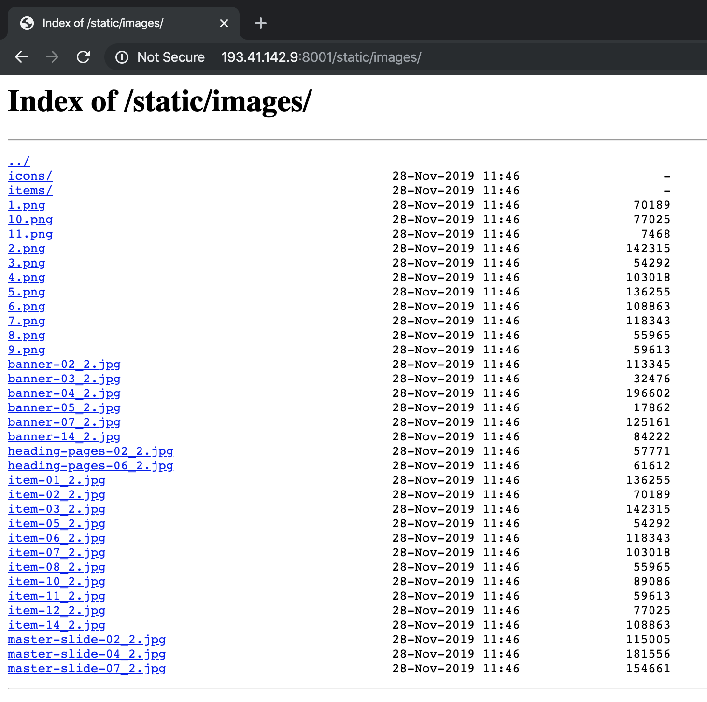

Товаров 10, но мы видим 11.png

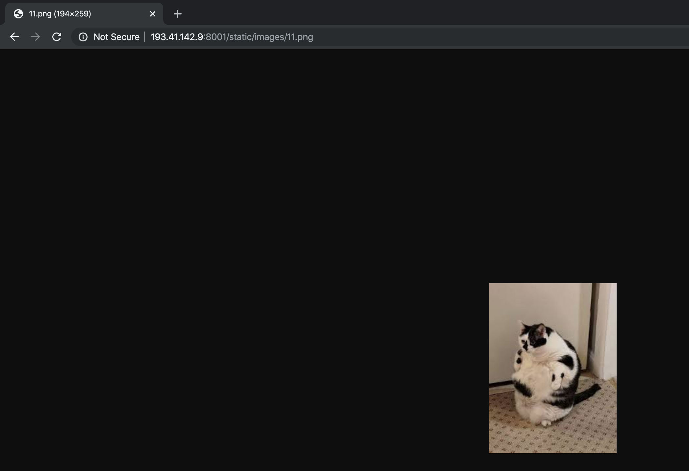

Какой-то котик! А скрытый ли это товар, который мы безуспешно пытались найти?

Возвращаемся к страничке продуктов, пробуем новые инъекции:
- `1' or id == 11; --`

Безрезультатно :( <br>
А может в SQL-запросе используют двойные кавычки?
- `1\" or 1 = 1; --`

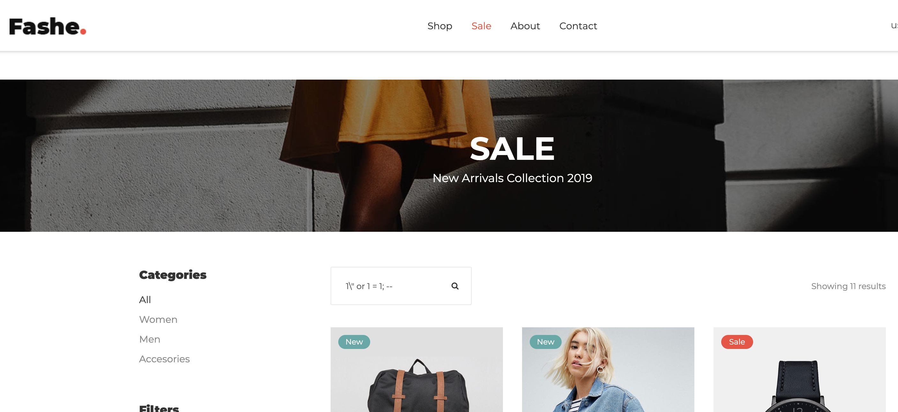

"Showing 11 results" - та дам!

Смотрим, что это за 11й продукт:

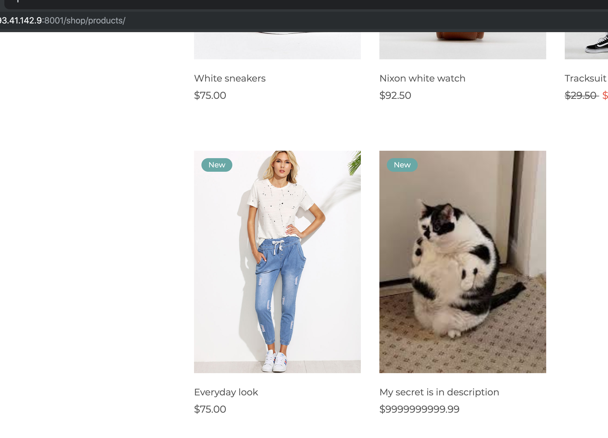

Как раз наш котик. И обещают флаг в описании:

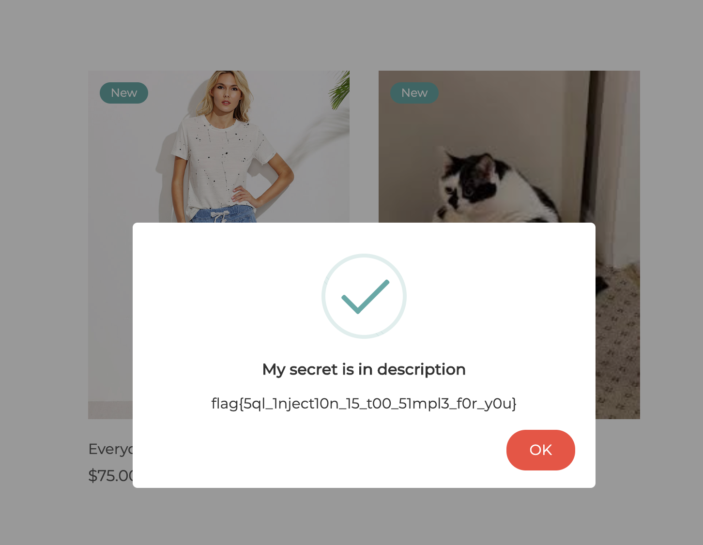

Вот и он - **flag{5ql_1nject10n_15_t00_51mpl3_f0r_y0u}**!

<a name="files"></a>
## File reading
#### Зачастую мы сталкиваемся с утекающими исходниками и странной логикой работы. Возможные вектора атак обычно находятся фаззингом. Предлагаю тебе этим заняться.

Фаззинг — это методика тестирования программного обеспечения, суть которой заключается в автоматизированном обнаружении ошибок реализации путем отправки заведомо неверных данных и анализе реакции программы на них.

В контексте веб-приложения это обычно нахождение перебором URL'ов, потенциально интересных для атак.

Например, попробуем найти админку
```bash
http://193.41.142.9:8001/admin/
http://193.41.142.9:8001/admin
```

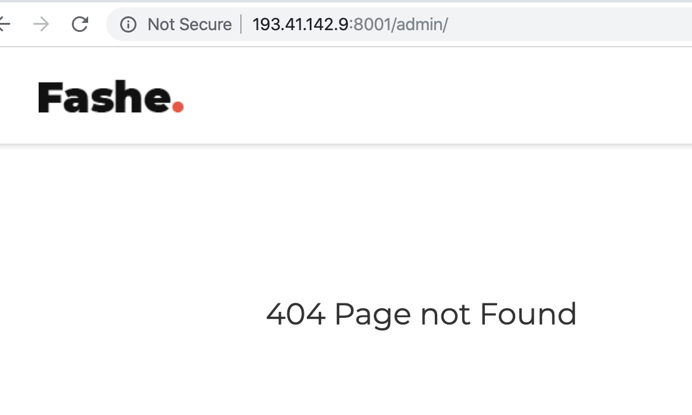

Так-с, ладно, до этого мы уже обнаружили статику, поищем в ней:
```
$ wget -r http://193.41.142.9:8001/static/
$ tree 193.41.142.9\:8001/ | wc -l
2574
```

Во всем этом разнообразии файлов были предприняты попытки:
- grep'нуть флаг
- найти уязвимость в папке static/admin
- найти уязвимость в .js файлах
- найти флаг среди изображений

Все безрезультатно :(

Спустя час, решаем воспользоваться настоящим фаззингом, раз нас об этом любезно попросили.

"fuzzing online" -> Google -> https://pentest-tools.com/website-vulnerability-scanning/discover-hidden-directories-and-files

Тулза успешно сканирует сайт и находит кроме статики директорию.. 

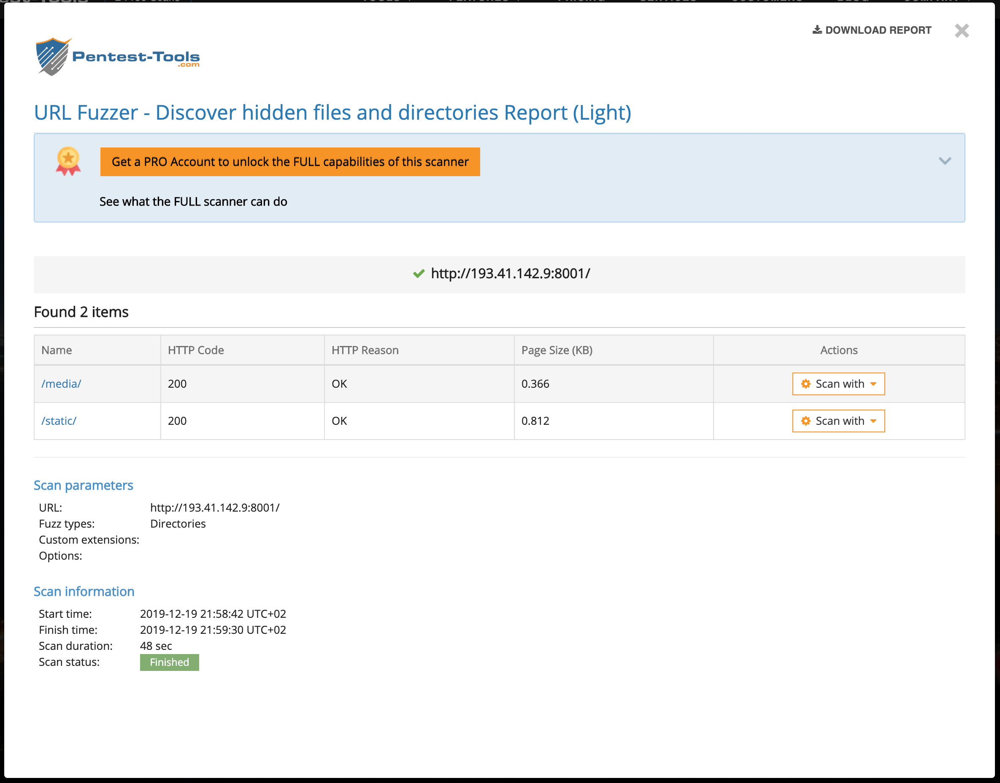

**media** :tired_face:!

Так очевидно...

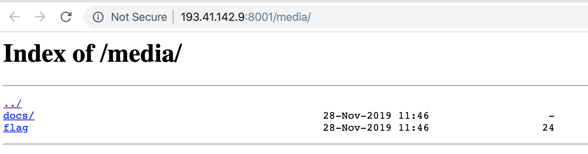

И наш долгожданный флаг внутри файла - **flag{y0u_g0t_0ur_s3cr3t}**!

<a name="cookies"></a>
## Cookies
#### Проверь безопасность cookies. Возможно, ты сможешь получить доступ к правам админа.

Заходим за пользователя.


Смотрим наши куки:
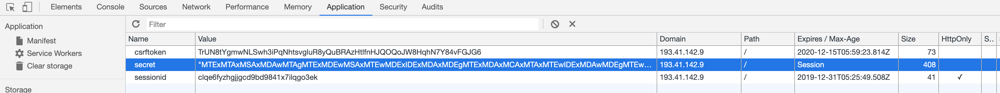

Значение куки secret: `"MTExMTAxMSAxMDAwMTAgMTExMDEwMSAxMTEwMDExIDExMDAxMDEgMTExMDAxMCAxMTAxMTEwIDExMDAwMDEgMTEwMTEwMSAxMTAwMTAxIDEwMDAxMCAxMTEwMTAgMTAwMDEwIDExMTAxMDEgMTExMDAxMSAxMTAwMTAxIDExMTAwMTAgMTAwMDEwIDEwMTEwMCAxMDAwMDAgMTAwMDEwIDExMDEwMDEgMTExMDAxMSAxMDExMTExIDExMDAwMDEgMTEwMDEwMCAxMTAxMTAxIDExMDEwMDEgMTEwMTExMCAxMDAwMTAgMTExMDEwIDEwMDAxMCAxMDAwMTEwIDExMDAwMDEgMTEwMTEwMCAxMTEwMDExIDExMDAxMDEgMTAwMDEwIDExMTExMDE="`

Знак `=` в конце намекает на base64, расшифруем с помощью Python:
```python
import base64

s = "MTExMTAxMSAxMDAwMTAgMTExMDEwMSAxMTEwMDExIDExMDAxMDEgMTExMDAxMCAxM" \
    "TAxMTEwIDExMDAwMDEgMTEwMTEwMSAxMTAwMTAxIDEwMDAxMCAxMTEwMTAgMTAwMD" \
    "EwIDExMTAxMDEgMTExMDAxMSAxMTAwMTAxIDExMTAwMTAgMTAwMDEwIDEwMTEwMCA" \
    "xMDAwMDAgMTAwMDEwIDExMDEwMDEgMTExMDAxMSAxMDExMTExIDExMDAwMDEgMTEw" \
    "MDEwMCAxMTAxMTAxIDExMDEwMDEgMTEwMTExMCAxMDAwMTAgMTExMDEwIDEwMDAxM" \
    "CAxMDAwMTEwIDExMDAwMDEgMTEwMTEwMCAxMTEwMDExIDExMDAxMDEgMTAwMDEwID" \
    "ExMTExMDE="
decoded = base64.b64decode(s).decode()
print(decoded)
```

Получаем
```
1111011 100010 1110101 1110011 1100101 1110010 1101110 1100001 1101101 1100101 100010 111010 100010 1110101 1110011 1100101 1110010 100010 101100 100000 10001
0 1101001 1110011 1011111 1100001 1100100 1101101 1101001 1101110 100010 111010 100010 1000110 1100001 1101100 1110011 1100101 100010 1111101
```

Преобразуем в десятичные числа:
```python
ascii = [int(bin, 2) for bin in decoded.split(' ')]
print(ascii)
```

Получаем
```
[123, 34, 117, 115, 101, 114, 110, 97, 109, 101, 34, 58, 34, 117, 115, 101, 114, 34, 44, 32, 34, 105, 115, 95, 97, 100, 109, 105, 110, 34, 58, 34, 70, 97, 108
, 115, 101, 34, 125]
```

Преобразуем в текст:
```python
ascii_str = ''.join(map(chr, ascii))
print(ascii_str)  # {"username":"user", "is_admin":"False"}
```

Да это же JSON!

Напишем функции, позволяющие из куки получать JSON и обратно:
```python
def from_secret(data) -> str:
    return ''.join(
        chr(int(bin, 2))
        for bin in base64.b64decode(data).decode().split(' ')
    )

def to_secret(data) -> str:
    # [2:] обрезает '0b'
    return base64.b64encode(
        ' '.join(bin(ord(i))[2:] for i in data).encode()
    ).decode()
```

А теперь включим-ка себе права админа:
```python
print(to_secret('{"username":"admin", "is_admin":"True"}'))
```

Получаем:
```
MTExMTAxMSAxMDAwMTAgMTExMDEwMSAxMTEwMDExIDExMDAxMDEgMTExMDAxMCAxMTAxMTEwIDExMDAwMDEgMTEwMTEwMSAxMTAwMTAxIDEwMDAxMCAxMTEwMTAgMTAwMDEwIDExMDAwMDEgMTEwMDEwMCAxMTAxMTAxIDExMDEwMDEgMTEwMTExMCAxMDAwMTAgMTAxMTAwIDEwMDAwMCAxMDAwMTAgMTEwMTAwMSAxMTEwMDExIDEwMTExMTEgMTEwMDAwMSAxMTAwMTAwIDExMDExMDEgMTEwMTAwMSAxMTAxMTEwIDEwMDAxMCAxMTEwMTAgMTAwMDEwIDEwMTAxMDAgMTExMDAxMCAxMTEwMTAxIDExMDAxMDEgMTAwMDEwIDExMTExMDE=
```

Подставляем новую куки на сайт через плагин для Chrome: http://www.editthiscookie.com/.
Ходим по страничкам магазина в поисках секретной информации...

Безрезультатно :(

Может, добавить еще полей в соответствии с https://docs.djangoproject.com/en/2.2/ref/contrib/auth/#user-model?

```python
data = '{"username":"admin", "is_admin":"True", "is_superuser":"True", "is_staff":"True"}'
print(to_secret(data))
```

```
MTExMTAxMSAxMDAwMTAgMTExMDEwMSAxMTEwMDExIDExMDAxMDEgMTExMDAxMCAxMTAxMTEwIDExMDAwMDEgMTEwMTEwMSAxMTAwMTAxIDEwMDAxMCAxMTEwMTAgMTAwMDEwIDExMDAwMDEgMTEwMDEwMCAxMTAxMTAxIDExMDEwMDEgMTEwMTExMCAxMDAwMTAgMTAxMTAwIDEwMDAwMCAxMDAwMTAgMTEwMTAwMSAxMTEwMDExIDEwMTExMTEgMTEwMDAwMSAxMTAwMTAwIDExMDExMDEgMTEwMTAwMSAxMTAxMTEwIDEwMDAxMCAxMTEwMTAgMTAwMDEwIDEwMTAxMDAgMTExMDAxMCAxMTEwMTAxIDExMDAxMDEgMTAwMDEwIDEwMTEwMCAxMDAwMDAgMTAwMDEwIDExMDEwMDEgMTExMDAxMSAxMDExMTExIDExMTAwMTEgMTExMDEwMSAxMTEwMDAwIDExMDAxMDEgMTExMDAxMCAxMTEwMTAxIDExMTAwMTEgMTEwMDEwMSAxMTEwMDEwIDEwMDAxMCAxMTEwMTAgMTAwMDEwIDEwMTAxMDAgMTExMDAxMCAxMTEwMTAxIDExMDAxMDEgMTAwMDEwIDEwMTEwMCAxMDAwMDAgMTAwMDEwIDExMDEwMDEgMTExMDAxMSAxMDExMTExIDExMTAwMTEgMTExMDEwMCAxMTAwMDAxIDExMDAxMTAgMTEwMDExMCAxMDAwMTAgMTExMDEwIDEwMDAxMCAxMDEwMTAwIDExMTAwMTAgMTExMDEwMSAxMTAwMTAxIDEwMDAxMCAxMTExMTAx
```

Пробуем и эту куки... Снова ничего не происходит.
Увы :(

---

**UPDATE** после завершения соревнования.

Разбор: https://youtu.be/6Dm-gk86yJk

Оказывается, при кодировании JSON нужно дополнять бинарные числа нулями до 8, что не отражено в исходной куки. :cry: <br>
Кроме этого проверка идет не на уровне данных, а просто как сравнение закодированных строк :facepalm:

Исправляем нашу функцию, нам поможет **format**
```python
print(format(11, '08b'))  # 00001011
```  

```python
def to_secret(data) -> str:
    return base64.b64encode(
        ' '.join(format(ord(i), '08b') for i in data).encode()
    ).decode()

print(to_secret('{"username":"admin", "is_admin":"True"}'))
```

Получаем:
```
MDExMTEwMTEgMDAxMDAwMTAgMDExMTAxMDEgMDExMTAwMTEgMDExMDAxMDEgMDExMTAwMTAgMDExMDExMTAgMDExMDAwMDEgMDExMDExMDEgMDExMDAxMDEgMDAxMDAwMTAgMDAxMTEwMTAgMDAxMDAwMTAgMDExMTAxMDEgMDExMTAwMTEgMDExMDAxMDEgMDExMTAwMTAgMDAxMDAwMTAgMDAxMDExMDAgMDAxMDAwMDAgMDAxMDAwMTAgMDExMDEwMDEgMDExMTAwMTEgMDEwMTExMTEgMDExMDAwMDEgMDExMDAxMDAgMDExMDExMDEgMDExMDEwMDEgMDExMDExMTAgMDAxMDAwMTAgMDAxMTEwMTAgMDAxMDAwMTAgMDEwMTAxMDAgMDExMTAwMTAgMDExMTAxMDEgMDExMDAxMDEgMDAxMDAwMTAgMDExMTExMDE=
```
Подставляем в куки и вуаля: вместо истории покупок мы видим флаг **flag{d0_y0u_l1k3_c00k13s}**!


